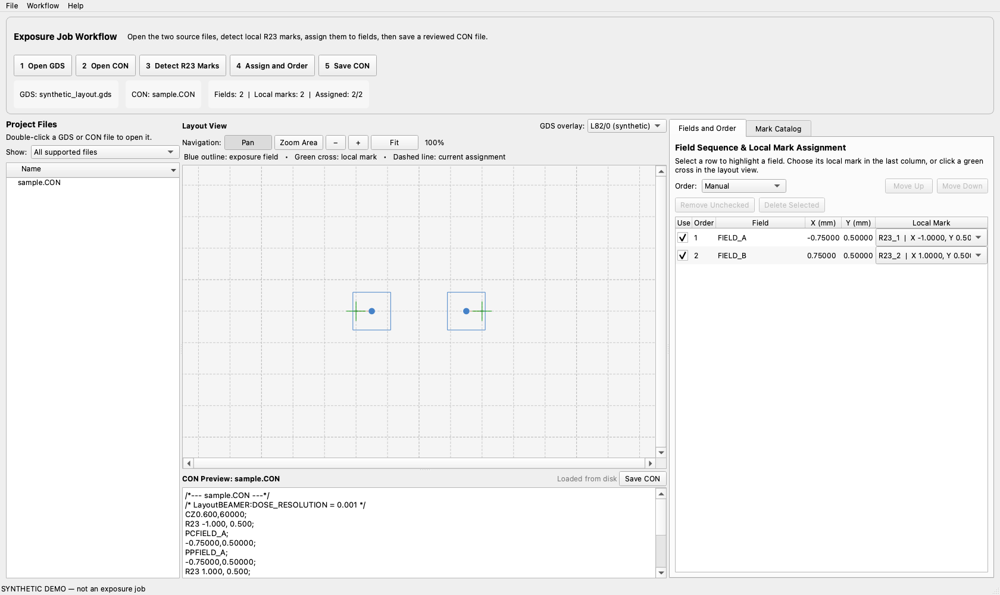
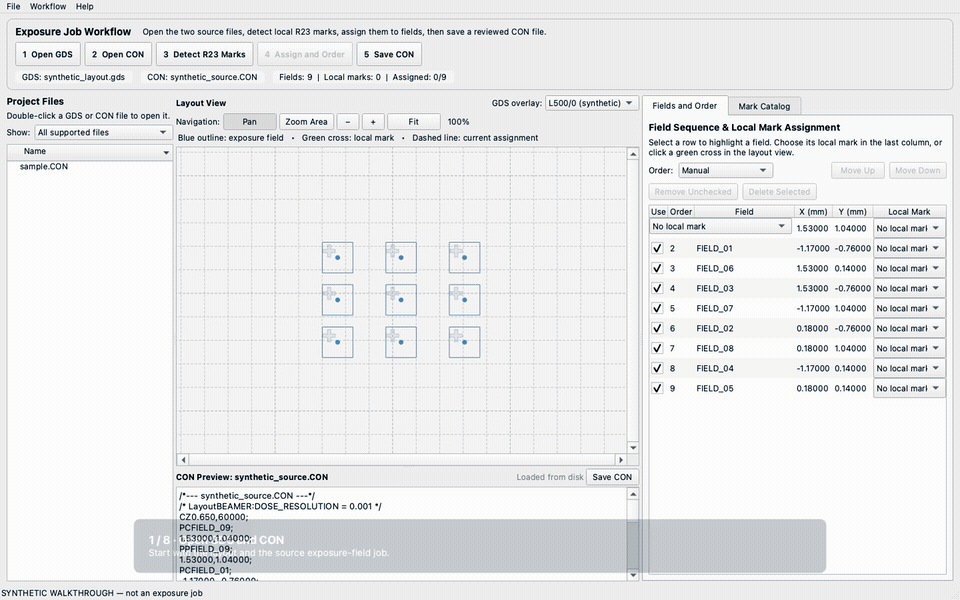

# Lithography Exposure Planner

A visual, cross-platform desktop application for finding local alignment
marks and preparing exposure-job files for electron-beam lithography.

Status: beta, version 0.3.0. The same Python/PyQt6 codebase targets macOS and
Windows. The application prepares jobs; it does not control an EBL system.



## Quick walkthrough



[Watch the MP4 version](docs/media/lithography-exposure-planner-demo.mp4).
The slower 35-second walkthrough and includes short English captions. 
It explicitly shows how an operator can replace the local
mark assigned to a field before reordering and saving the job.
See the [walkthrough script and accessibility text](docs/DEMO_WALKTHROUGH.md).

## Purpose

Complex EBL jobs can contain many local alignment marks and exposure fields.
Manual CON-file preparation makes it difficult to track which mark belongs to
each field while maintaining the intended exposure sequence.

Lithography Exposure Planner combines local-mark discovery in GDSII, visual
field-to-mark assignment, and field reordering in one desktop interface. It is
useful for transistor layouts and for any other topology with many local marks
and exposure fields.

The current implementation targets the CRESTEC CABL-9500C workflow and a
validated subset of CON syntax. Adaptation to another EBL system requires a
dedicated, tested importer/exporter for that system's job format and alignment
semantics. An R23 command on another system does not by itself prove
compatibility.

The application does not acquire a physical mark signal, move the stage, set
process parameters, or start exposure. An operator must review the final job.

## Guided workflow

The English interface presents the preparation sequence directly:

1. **Open GDS** — load the layout containing local alignment crosses.
2. **Open CON** — load the source exposure-field job.
3. **Detect R23 Marks** — select the exact GDS layer/datatype and detect crosses.
4. **Assign and Order** — assign a local mark to each field and review field order.
5. **Save CON** — write the reviewed file while preserving a backup.

GDSII and CON can be loaded in either order. Detected GDS positions remain in
the mark catalog after a CON file is opened. Existing CON mark IDs,
coordinates, and assignments are preserved. New positions appear as
`GDS_R23_*` and enter the generated CON only after explicit assignment.

## Main capabilities

- Load GDSII and inspect exact layer/datatype pairs.
- Detect centers of cross-shaped local marks on a selected layer.
- Account for GDS units and supported translation, rotation, scaling, and
  reflection of directly placed SREF marks.
- Load, visualize, edit, and safely regenerate supported CON files.
- Assign marks explicitly from a distance-sorted list or by selecting a field
  and clicking a green mark in the layout view.
- Review a read-only mark catalog showing the names of assigned fields.
- Navigate large layouts with Pan, a rectangular Zoom Area magnifier,
  zoom-in/out controls, Fit, and always-visible horizontal and vertical scrollbars.
- Assign the geometrically nearest mark to every field as an optional starting
  point; every result still requires operator review.
- Reorder fields manually or with Snake, Raster, and Radial (center-out) paths.
- Keep mark assignments attached to fields while their order changes.
- Save CON atomically and create a `.CON.bak` backup.
- Record startup and unexpected-error logs.
- Build native application bundles for macOS and Windows.

## Platforms

| Platform | Package | Validation status |
| --- | --- | --- |
| macOS / Apple Silicon | `.app` | Locally tested on macOS 13.7.8 |
| macOS / Intel | separate `.app` | Build and CI prepared; native validation pending |
| Windows 10/11 x64 | `.exe` folder bundle | Build and CI prepared; native validation pending |

A packaged application does not require a separate Python installation.
Public binary packages have not been released. Running from source requires
Python 3.10+; reference builds use Python 3.12 and
`constraints-build.txt`.

Core dependencies are PyQt6, gdspy, and NumPy. Building gdspy from source may
require a C/C++ compiler. See [cross-platform notes](docs/CROSS_PLATFORM.md).

## Running the application

### From an existing development environment

```sh
python src/main.py
```

### First run from source

- macOS: open `run.command`.
- Windows: open `run.bat` (the bootstrap uses the Python Launcher,
  `py -3.12`, when available).

The bootstrap creates `.venv` and installs the declared dependencies. Do not
copy a virtual environment between computers or operating systems.

### Local native package

After a local build, versioned output is written to `dist/0.3.0`:

- macOS: open `Lithography Exposure Planner.app`.
- Windows: extract the complete archive and open
  `Lithography Exposure Planner.exe`; keep the `_internal` folder beside it.

Native packages are operating-system and architecture specific. Current local
packages are not signed/notarized public releases.

## Supported CON model

The current parser supports a fail-closed subset containing:

- `CZ`;
- global `R2` and local `R23` marks;
- paired `PC`/`PP` fields with matching coordinates;
- `!END`;
- comments.

A local-mark command is serialized in numeric form:

```text
R23 0.000, 0.000;
```

Coordinates are interpreted as millimetres in the current model. Local marks
are written to 0.001 mm and fields to 0.00001 mm. Confirm units and required
precision against the target tool documentation.

Automatic regeneration is blocked when the source contains unsupported
commands, inconsistent PC/PP coordinates, missing marks, duplicate field
names, or an ambiguous mark reset. The source text remains available for
manual review.

R23 is not a universal EBL command. See
[tool compatibility and R23 assumptions](docs/TOOL_COMPATIBILITY.md).

## Safety and limitations

- Nearest-by-distance is not necessarily the technologically correct mark.
- Mark detection uses geometry and clustering heuristics; visually verify the
  detected centers.
- Nested mark hierarchies and CellArray variants are not fully validated.
- Radial ordering is center-out ordering, not a mathematically exact spiral.
- Only marks assigned to fields are emitted during CON regeneration.
- Large GDS files are currently processed synchronously.
- Dose, beam energy/current, resist, development, proximity correction, and
  other process-recipe values are outside the application.
- Real exposure and compatibility with EBL systems other than the stated
  CRESTEC workflow have not been validated.

Use the [EBL operator checklist](docs/EBL_OPERATOR_CHECKLIST.md) before
exposure.

## Logs

- macOS: `~/Library/Logs/Lithography Exposure Planner/application.log`
- Windows:
  `%LOCALAPPDATA%\Lithography Exposure Planner\Logs\application.log`

Open the folder from **Help → Open Log Folder**. Native crash details are also
written to `native-crash.log`.

## Tests and builds

```sh
python -m pip install -r requirements.txt -r requirements-dev.txt -c constraints-build.txt
python -m pytest
python scripts/build_app.py
```

Build on the target operating system; PyInstaller is not a cross-compiler.
Convenience scripts are `scripts/build_macos.sh` and
`scripts/build_windows.bat`.


